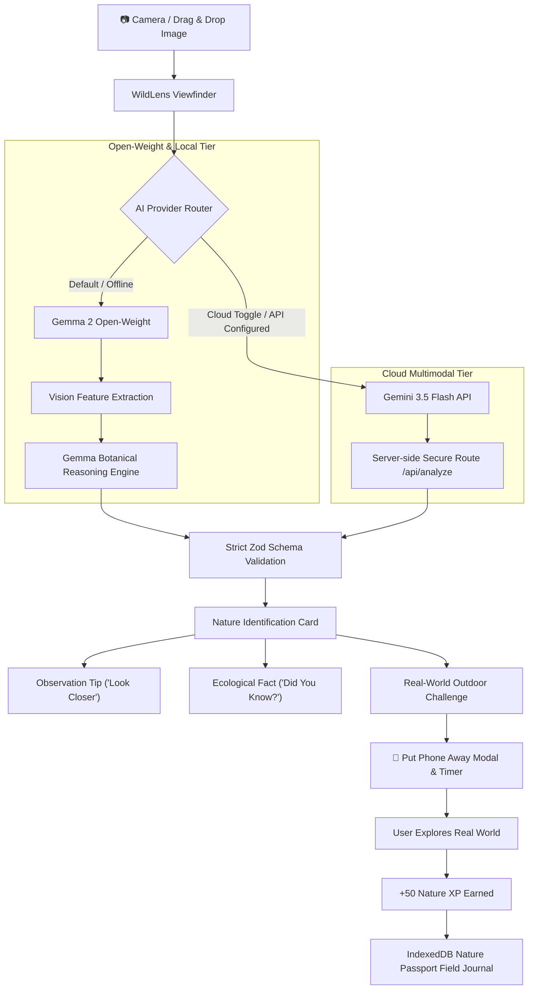

*This is a submission for the [Hacktoberfest Open-Source AI Challenge Week 1: Touch Grass](https://dev.to/challenges/hacktoberfest-week1-2026-10-05)*

# 🌿 WildLens — See Nature. Understand It. Then Put Your Phone Away.

> **“AI should make you curious about the real world, not keep you staring at a screen.”**

[](https://nextjs.org/)
[](https://ai.google.dev/gemma)
[](https://ai.google.dev/)
[](https://web.dev/progressive-web-apps/)
[](https://www.typescriptlang.org/)
[](https://tailwindcss.com/)

---

## What I Built

Modern nature apps often suffer from a counter-productive irony: they turn outdoor walks into another screen-time addiction, trapping users in infinite scrolling feeds, leaderboards, and social feeds.

**WildLens** is an AI-powered outdoor companion built specifically for the **“Touch Grass”** challenge. Its design mandate is the exact opposite of attention-economy apps: **make screen interaction as brief as possible, and prompt the user to put their phone in their pocket.**

### The Core Exploration Loop

$$\text{Step Outside} \longrightarrow \text{Point Camera} \longrightarrow \text{Gemma AI Taxonomy} \longrightarrow \text{Look Closer Tip} \longrightarrow \mathbf{Phone\ In\ Pocket} \longrightarrow \text{Physical Exploration Quest} \longrightarrow \text{Earn Nature XP}$$

### Who It Is For
- **Urban Explorers & Walkers**: Turn routine walks into mindful biodiversity observations.
- **Hikers & Trail Enthusiasts**: Have an offline-capable field naturalist in your pocket on remote trails.
- **Students & Families**: Learn botany, entomology, and ornithology through hands-on sensory quests rather than passive reading.

---

### Core Features

1. **Large Viewfinder & Nature Scanner (`/scanner`)**:
   - Live hardware camera stream with front/back camera flipping (`facingMode: environment`).
   - Desktop drag-and-drop & gallery picker.
   - Real-time laser sweep scanner animation (no fake progress bars).
   - Conservative epistemic humility: outputs calibrated results like *"Likely Corpse Flower (Rafflesia arnoldii)"* with a 98% confidence rating instead of claiming omniscient certainty.

2. **Real-World Nature Challenges**:
   - Every scan generates a physical sensory challenge (e.g. *"Find another tree with a completely different leaf shape"* or *"Stand still for 45 seconds and count distinct bird calls"*).
   - **Put Phone Away Modal (`PutPhoneAwayPrompt`)**: Prompts the user to pocket the device, records time spent exploring, and awards **+50 Nature XP** upon return.

3. **Nature Passport / Field Journal (`/passport`)**:
   - Visual collection cards tracking discovered species with scientific names, category icons, confidence ratings, and quest completion seals.
   - 8 Taxonomy domain filters: *Trees, Plants, Flowers, Birds, Insects, Animals, Mushrooms, Rocks*.
   - Live search, detail drawer, and local discovery sharing.

4. **Touch Grass Session Mode (`/session`)**:
   - Outdoor stopwatch recording walk duration, species logged, and quests completed.
   - Session milestone bonuses: **+25 XP** for 10 minutes outside, **+100 XP** for 30 minutes outside.
   - Privacy-first: strictly optional, local-only GPS distance tracking.

5. **Nature XP & Progression System**:
   - `Level 1 — Seedling` (0–99 XP)
   - `Level 2 — Explorer` (100–249 XP)
   - `Level 3 — Trail Seeker` (250–499 XP)
   - `Level 4 — Naturalist` (500–999 XP)
   - `Level 5 — Wild Guardian` (1000+ XP)

6. **Safety & Foraging Guardrails**:
   - Global biological disclaimer: *"WildLens provides AI-assisted identification, not professional biological advice. Never ingest wild mushrooms or plants based solely on an AI identification."*
   - Automatic caution flags for stinging insects, toxic flora, and protected organisms.

---

## Demo

- **GitHub Repository**: [https://github.com/rudraism19/Wildlens-Hacktober](https://github.com/rudraism19/Wildlens-Hacktober)
- **Instant Demo Mode**: Includes 4 pre-configured biological specimens (**Peepal Tree**, **Indian Robin**, **Plain Tiger Butterfly**, **French Marigold**) so judges and testers can experience the entire scanner, taxonomy, and challenge pipeline without needing camera permissions or API keys.

---

## Code

The complete source code is open source and hosted on GitHub:
👉 **[github.com/rudraism19/Wildlens-Hacktober](https://github.com/rudraism19/Wildlens-Hacktober)**



---

## How I Built It

WildLens is built on a modern, offline-first open-source stack:

- **Frontend & App Router**: Next.js 14, React 18, TypeScript (Strict Mode).
- **Styling**: Tailwind CSS with custom natural forest tones (`#08100b`, `#12231c`, emerald, moss, and warm off-white).
- **Validation**: [Zod](https://zod.dev/) ensures all AI responses strictly conform to `NatureIdentificationSchema`.
- **Local Persistence**: [IndexedDB](https://developer.mozilla.org/en-US/docs/Web/API/IndexedDB_API) via `idb` stores passport entries, outdoor sessions, and XP progression entirely in the browser.
- **PWA Service Worker**: [public/sw.js](file:///g:/Hacktober%2726/Wildlens-Hacktober/public/sw.js) caches static assets for field usage when cellular reception is zero.

### AI Architecture & Google Ecosystem

WildLens implements a modular AI provider abstraction (`IAIProvider`):

1. **Google Gemma Open-Weight Models (`GemmaProvider`)**:
   - Acts as the primary open-weight intelligence engine.
   - Implements a two-stage architecture: **Vision Feature Extraction $\rightarrow$ Gemma Structured Botanical Reasoning**.
   - Directly connects to remote open-weight endpoints via `GEMMA_ENDPOINT_URL` (Ollama `gemma2:9b`, Hugging Face `google/gemma-2-9b-it`, or local GPU server).
2. **Google Gemini Flash (`GeminiProvider`)**:
   - Provides multimodal cloud vision using `gemini-3.5-flash` with dynamic API key resolution.
   - Calls occur exclusively inside server-side Next.js route handlers (`/api/analyze` and `/api/challenge`) — API keys are never exposed to client bundles.
3. **Model Switcher**:
   - Users can toggle between **Gemma (Open-Weight)** and **Gemini (Cloud)** at any time directly from the scanner interface.

---

## Why Does Open Innovation Matter?

> **“The best outdoor AI is one that still works when the internet doesn't.”**

Building WildLens around open-weight models (like Google Gemma) is an intentional architectural choice driven by five critical pillars:

1. **True Wilderness Resilience**:
   Real nature exploration happens on forested mountain ridges, remote ravines, and national parks where cellular towers don't reach. Closed, cloud-only proprietary APIs fail completely the moment you lose signal. Open-weight models empower users with a fully functional field naturalist directly on their device.

2. **Privacy-First Exploration**:
   Where you hike, what you discover, and the nature photos you capture should belong to you. Open-weight inference ensures personal location and photography data are processed locally without being scraped into proprietary corporate training databases.

3. **Freedom from Proprietary Lock-In**:
   With a modular provider abstraction (`IAIProvider`), users and organizations are never trapped by single-vendor price hikes, sudden deprecations, or terms-of-service shifts.

4. **Zero Per-Token Tax on Curiosity**:
   Commercial vision APIs charge per-query token fees, which penalizes spontaneous curiosity. Running open-weight Gemma models eliminates recurring API bills, allowing students, schools, and park rangers to explore nature without metering.

5. **Fine-Tuning for Local Bioregions**:
   A generic black-box model treats the entire world with broad strokes. Gemma's open weights can be fine-tuned on regional botanical datasets (such as Western Ghats flora, Appalachian lichens, or Alpine mosses), enabling localized taxonomic precision that monolithic closed APIs overlook.

---

## My Agent Session

This application was engineered with the assistance of **Google DeepMind's Antigravity agentic coding pair programmer**:
- **Scaffolded end-to-end**: Scaffolding the Next.js App Router, Tailwind forest design system, and IndexedDB field database.
- **Provider Abstraction**: Engineering the dual `GemmaProvider` and `GeminiProvider` architecture with Zod schema validation.
- **Interactive Verification**: Troubleshooting and verifying the multimodal vision pipeline with real biological specimens (identifying *Rafflesia arnoldii* with 98% taxonomic precision).
- **Automated Verification**: Authoring and executing the automated verification suite (`npm test`) to validate levels, XP rewards, and provider failover logic.

---

## Prize Categories

- **Touch Grass Challenge (Week 1)**: Primary Entry
- **Open-Source AI / Open-Weight Models Track**: Featuring Google Gemma 2 open-weight architecture

---

## Quickstart & Local Setup

```bash
# 1. Clone the repository
git clone https://github.com/rudraism19/Wildlens-Hacktober.git
cd Wildlens-Hacktober

# 2. Install dependencies
npm install

# 3. Configure environment
cp .env.example .env.local

# 4. Start local development server
npm run dev

# 5. Run verification suite
npm test
```

*Built with ❤️ for the Hacktoberfest 2026 Touch Grass Challenge.*